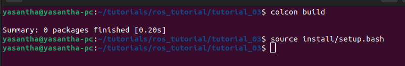

# Tutorial 03 - Create and Configuring Workspace in ROS2

## Table of Contents
1. [What This Tutorial is About](#what-this-tutorial-is-about)
2. [Prerequisites](#prerequisites)
3. [Required Packages](#required-packages)
4. [Installation](#installation)
5. [Running the Tutorial](#running-the-tutorial)
6. [Use Cases](#use-cases)
7. [Working Screenshots](#working-screenshots)
8. [Additional Resources](#additional-resources)

## What This Tutorial is About

This tutorial will guide you through creating and configuring a workspace in ROS2. A **workspace** is a directory where you can store multiple ROS packages. It is a convenient way to organize your ROS projects and packages. In this tutorial, you will learn how to create a workspace, add packages to it, and configure it to work with ROS2.

## Prerequisites

- Basic knowledge of ROS2 concepts
- ROS2 installed on your system
- A code editor or IDE (e.g., Visual Studio Code, Atom, etc.)

## Required Packages
- ROS2 (Humble version)

## Installation

1. Open a terminal window.
2. Update the packages

    ```bash
    sudo apt update
    ```
>[!NOTE]
> Make sure that you have already added the ros2 path to source list. If not, follow the below steps
> ```bash
> echo "source /opt/ros/humble/setup.bash" >> ~/.bashrc && source ~/.bashrc
> ```

3. Install Colcon

    ```bash
    sudo apt install python3-colcon-common-extensions
    ```
> [!TIP]
> For enable autocompletion in colcon,Follow the below steps
> ```bash
> echo "source /usr/share/colcon_argcomplete/hook/colcon-argcomplete.bash" >> ~/.bashrc && source ~/.bashrc
> ```

4. Create a workspace directory

    ```bash
    mkdir -p ~/ros2_ws/src
    cd ~/ros2_ws
    ```


## Running the Tutorial

1. Build the workspace

    ```bash
    colcon build
    source install/setup.bash
    ```


## Use Cases

- **Creating a Workspace**: You can create a workspace to store multiple ROS packages. This makes it easier to manage your projects and packages.

## Working Screenshots

1. **Creating a Workspace**

    

## Additional Resources

- [ROS2 Tutorial](https://docs.ros.org/en/foxy/Tutorials/Beginner-Client-Libraries/Colcon-Tutorial.html)
- [Youtube Video](https://www.youtube.com/watch?v=3GbrKQ7G2P0&list=PLLSegLrePWgJudpPUof4-nVFHGkB62Izy&index=3)

