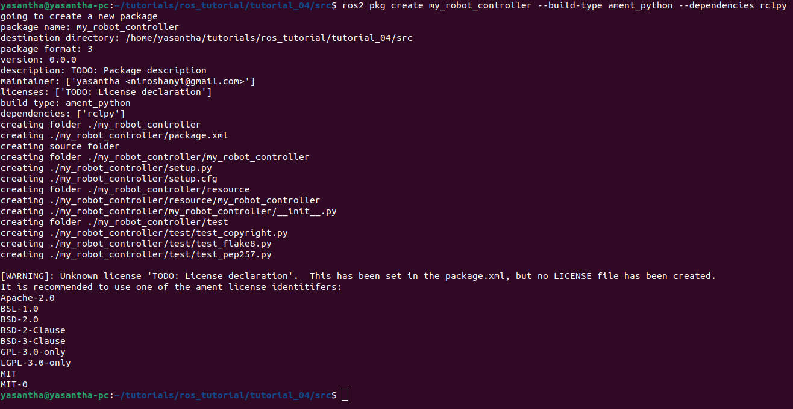

# Tutorial 04 - Creating Packages in ROS2

## Table of Contents
1. [What This Tutorial is About](#what-this-tutorial-is-about)
2. [Prerequisites](#prerequisites)
3. [Required Packages](#required-packages)
4. [Installation](#installation)
5. [Running the Tutorial](#running-the-tutorial)
6. [Explnations](#explnations)
    - [Package Structure](#package-structure)
    - [Package Configuration](#package-configuration)
    - [Setup Configuration](#setup-configuration)
7. [Use Cases](#use-cases)
8. [Working Screenshots](#working-screenshots)
9. [Additional Resources](#additional-resources)

## What This Tutorial is About

This tutorial provides a step-by-step guide on creating a new package in ROS2. The package created in this tutorial is named `my_robot_controller` and is a Python package that uses the `rclpy` library. The tutorial covers the following topics:

## Prerequisites

- Basic knowledge of ROS2 concepts
- ROS2 installed on your system
- A code editor or IDE (e.g., Visual Studio Code, Atom, etc.)
- Workspace setup in ROS2

## Required Packages
- ROS2 (Humble version)
- Colcon (ROS2 build tool)


## Installation

1. Open a terminal window.
2. Navigate to the `src` directory in your ROS2 workspace.
    ```bash
    cd ~/ros2_ws/src
    ```
>[!NOTE]
> If you haven't created a workspace yet, you can do so by following the tutorial 03 [here](https://github.com/yasanthaniroshan/CS3340-Robotics-and-Automation/tree/main/tutorial_03)

3. Create a new package using the following command:

    ```bash
    ros2 pkg create my_robot_controller --build-type ament_python --dependencies rclpy
    ```
    - This command creates a new package named `my_robot_controller` with the build type `ament_python`.
    - ament_python is the build type for Python packages in ROS2.
    - The package has a dependency on the `rclpy` package, which is the ROS2 Python client library.

4. Build the workspace using the following command:
    ```bash
    colcon build
    ```
    - This command builds the workspace and compiles the newly created package.


## Running the Tutorial

No specific steps are required to run this tutorial. The package created in this tutorial is a Python package that can be imported and used in other Python scripts.
You can view package using following command:
```bash
ros2 pkg list
```

## Explnations

### Package Structure
The package structure of the `my_robot_controller` package is as follows:

```
my_robot_controller/
├── my_robot_controller
│   ├── __init__.py
├── resource
├── test
├── package.xml
├── setup.py
└── setup.cfg
```

### Package Configuration
The `package.xml` file contains the package configuration details, such as package name, version, description, maintainer, dependencies, etc.

```xml
<package format="3">
  <name>my_robot_controller</name>
  <version>0.0.0</version>
  <description>TODO: Package description</description>
  <maintainer email="niroshanyi@gmail.com">yasantha</maintainer>
  <license>TODO: License declaration</license>

  <depend>rclpy</depend>

  <test_depend>ament_copyright</test_depend>
  <test_depend>ament_flake8</test_depend>
  <test_depend>ament_pep257</test_depend>
  <test_depend>python3-pytest</test_depend>

  <export>
    <build_type>ament_python</build_type>
  </export>
</package>
```

### Setup Configuration
The `setup.py` file contains the setup configuration for the package where we can define entry points, packages, etc.

```python
entry_points={
        'console_scripts': [
        ],
    },
```


## Use Cases

Package creation is useful when you want to organize your code into modular components that can be reused across different projects. By creating a package, you can encapsulate related functionality into a single unit and easily share it with others.

## Working Screenshots

1. Creating a new package using the `ros2 pkg create` command:
    

## Additional Resources
- [Creating a ROS2 Package](https://docs.ros.org/en/humble/Tutorials/Beginner-Client-Libraries/Creating-Your-First-ROS2-Package.html)
- Youtube Video Tutorial - [Creating a ROS2 Package](https://www.youtube.com/watch?v=iBGZ8LEvkCY&list=PLLSegLrePWgJudpPUof4-nVFHGkB62Izy&index=4)
